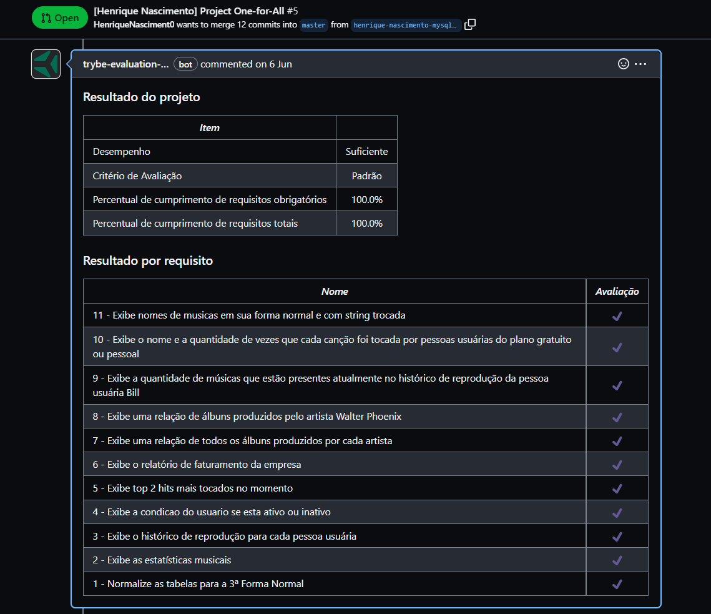

# Projet One For All

No projeto One For All, usei uma tabela para revisar e consolidar todos os principais conceitos vistos antes.

A tarefa foi pegar uma tabela não normalizada e então normaliza-la e popula-la para que fosse possível executar queries com o intuito de encontrar as informações solicitadas.

<details>
  <summary><strong>👨‍💻 Meu resultado</strong></summary><br />

</details>

## 🚀 Tecnologias

* _Bash_
* _Docker_
* _MySQL_
* _Workbench_
## 📌 Habilidades
Desenvolvi as seguintes habilidades:

Usar Workbench
Desenvolver query SQL
## ⬇️ Instalando dependências
 ```bash
 npm install
 ```

## 🧪 Executando os testes
Para rodar os testes:

```bash
docker-compose up -d
docker exec -it one_for_all bash
npm test
```

_Os testes não funcionarão pois a pasta de testes não está no repositório_
